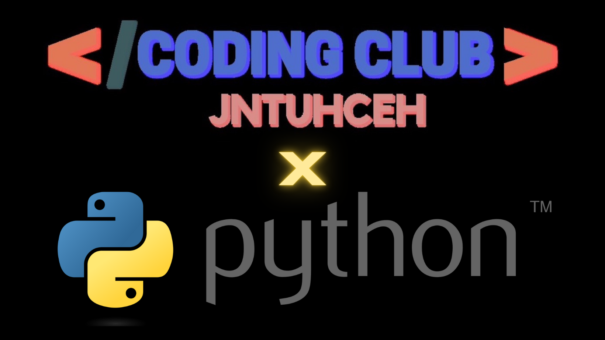

# Python Training Coding Club JNTUHCEH

The coordinators of Coding Club JNTUHCEH are organizing free Python Training Sessions for peers among the college.
Volunteers of Coding Club, namely Nikhil Nandam and Manas Rao are the instructors for this 12 week online Python Training Sessions.

## <ins>Curriculum</ins>

## 1. Introduction (2 Weeks)
- History
- What is Scripting Language?
- Features - Dynamic, Interpreted, Object oriented, Embeddable, Extensible, Large standard libraries, Free and Open source
- Differences between compiled vs interpreted language
- Environments to run python (VSCode, PyCharm, IDLE, Jupyter Notebooks)
- Hello World, Datatypes, Variables, Comments, Type conversions, Identifiers, Keywords.
- Operators
    - Arithmetic Operators
    - Comparison Operators
    - Python Assignment Operators
    - Logical Operators
    - Bitwise Operators
    - Shift operators
    - Membership Operators
    - Identity Operators
    - Ternary Operator
    - Operator precedence
    - Difference between “is” vs “==”
    - Input and output operators
        - Print
        - Input
        - Command-line arguments

## 2. Flow control (0.5 Weeks)
- Conditional control statements
    - If
    - If-else
    - If-elif-else
    - Nested-if
- Loop control statements
    - for
    - while
    - Nested loops
- Branching statements
    - Break
    - Continue
    - Pass
    - Return

## 3. Functions (1.5 Weeks)
- What is Function?
- Advantages of functions
- Syntax and Writing function
- Calling or Invoking function
- Classification of Functions
    - No arguments and No return values
    - With arguments and No return values
    - With arguments and With return values
    - No arguments and With return values
- Recursion
- Python argument type functions
    - Default argument functions
    - Required(Positional) arguments function
    - Keyword arguments function
    - Variable arguments functions
- ‘pass’ keyword in functions
- Lambda functions/Anonymous functions
- map()
- filter()
- reduce()
- Nested functions
- Non local variables, global variables
- Decorators

## 4. Data Structures and Types (2 Weeks)
- Introduction
- Importance of Data structures
- Applications of Data structures
- Types of Collections
- Strings, List, Tuple, Dictionary
    - Strings
        - What is string
        - Representation of Strings
        - Processing elements using indexing
        - Processing elements using Iterators
        - Manipulation of String using Indexing and Slicing
        - String operators
        - Methods of String object
        - String Formatting
        - String functions
        - String Immutability
    - List Collection
        - What is List
        - Need of List collection
        - Different ways of creating List
        - List comprehension
        - List indices
        - Processing elements of List through Indexing and Slicing
        - List object methods
        - List is Mutable
        - Mutable and Immutable elements of List
        - Nested Lists
    - Tuple Collection
        - What is tuple?
        - Different ways of creating Tuple
        - Method of Tuple object
        - Tuple is Immutable
        - Mutable and Immutable elements of Tuple
        - Process tuple through Indexing and Slicing
        - List v/s Tuple
    - Set Collection
        - What is set?
        - Different ways of creating set
        - Difference between list and set
        - Iteration Over Sets
        - Accessing elements of set
        - Python Set Methods
        - Python Set Operations
        - Union of sets
        - functions and methods of set
        - Python Frozen set
        - Difference between set and frozenset?
    - Dictionary Collection
        - What is dictionary?
        - Difference between list, set and dictionary
        - How to create a dictionary?
        - Accessing values of dictionary
        - Python Dictionary Methods
        - Copying dictionary
        - Updating Dictionary
        - Reading keys from Dictionary
        - Reading values from Dictionary
        - Reading items from Dictionary
        - Delete Keys from the dictionary
        - Sorting the Dictionary
        - Python Dictionary Functions and methods
        - Dictionary comprehension
	
### 5. Files & Exceptions (1 Week)
- Files
    - Introduction to files
    - Opening a file
    - File modes
    - Reading data from file
    - Writing data into file
    - Appending data into file
    - Line count in File
- Exceptions
    - What is an Exception?
    - Why exception handling?
    - Syntax error v/s Runtime error
    - Exception codes – AttributeError, ValueError, IndexError, TypeError…
    - Handling exception – try except block
    - Try with multi except
    - Handling multiple exceptions with single except block
    - Finally block
    - Try-except-finally
    - Try with finally
    - Raise keyword
    - Custom exceptions / User defined exceptions
    - Need for Custom exceptions

## 6. Object Oriented Programming in Python (2 Weeks)
- Procedural v/s Object oriented programming
- Principles of OOP – Encapsulation , Abstraction (Data Hiding)
- Classes and Objects
- Defining a class
- Types of variables – instance variables, class variables.
- Types of methods – instance methods, class method, static method
- Object initialization
- ‘self’ reference variable
- ‘cls’ reference variable
- Access modifiers – private , protected, public
- Encapsulation(Data Binding)
- What is polymorphism?
- Overriding
- Overloading
- Inheritance – single , multi level, multiple, hierarchical and hybrid inheritance and diamond inheritance
